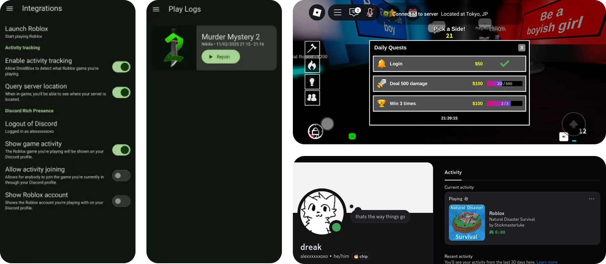

# DroidBlox
<div align="center">




[](https://discord.gg/kVmH76umHv)
</div>

----

DroidBlox is a bootstrapper for Roblox's android client that gives you additional features.

It is a [Bloxstrap](https://github.com/bloxstraplabs/bloxstrap) alternative to android except there are some features that are **not currently possible** in the android version.

## THIS APP REQUIRES ROOT!!
Wait for me to release a version that doesn't require root. Right now the technique used for non-root configuration (by using clone apps) is patched.

# When will it release?
Anytime soon, maybe if I dont procasinate about making it.

# WARNING!
It's unsure if you will get banned on Roblox for using this, if you have been banned, join [our Discord server](https://discord.gg/zFspvBwH92) and send the ban screenshot there.

The discord rich presence feature uses the Discord gateway connection. **Use it at your own risk.** This has also been stated in [Kizzy's repository.](https://github.com/dead8309/Kizzy?tab=readme-ov-file#download)

# Features
- **Integrations**
    - Launch other intents while launching Roblox (coming soon)
- **Activity Tracking**
    - Notifies you about your current server's location
    - Be able to set your RPC about your playing status (with [BloxstrapRPC](https://github.com/bloxstraplabs/bloxstrap/wiki/Integrating-Bloxstrap-functionality-into-your-game) supported) 
    - Choose if you want others to join you by looking at your RPC
    - Be able to rejoin the last game at the same server you joined
- **Fast Flags (NOT WORKING)**
    - Be able to customize them with ease
    - Merge your current fast flags with other ones
    - Retain your fast flags after updating
    - NOTE! Due to [Roblox's new policy that limits some fast flags](https://devforum.roblox.com/t/allowlist-for-local-client-configuration-via-fast-flags/3966569), some might only work when you set them at the Fast Flags section.

# But where's texture configuration?
Roblox recently loaded their assets inside the APK and I cannot find a way to modify the assets **without configuring the APK** which was possible before.

# TODO List
- [ ] Figure out how to set assets
- [x] Make the UX Design with KivyMD
- [ ] Optimize things

## Why do I need to login to Discord to use RPC?
The android version of Discord currently doesn't have a way to set your presence—instead, DroidBlox will connect to Discord and changes your presence just like [Kizzy](https://github.com/dead8309/Kizzy)

# WHY IS IT PYTHON!1!! ITS SO SLOW YK???
I only know python, ehh.. Feel free to recreate my project in Kotlin, Java, or other languages with credits by linking this github repository at yours.

# NOTE
Will be refactored into kotlin soon :33

## Building & Testing
1. Depending on your OS, you will need **OpenJDK 17** with the environment variables properly set (e.g. JAVA_HOME) and **ADB (Android Debug Bridge)**
2. Clone this repository
```sh
$ git clone https://github.com/meowstrapper/DroidBlox
$ cd DroidBlox
```
3. Install pip requirements
```sh
$ pip3 install -r requirements.txt
```
4. Build the APK (takes around >≈ 50 mins at the first build and >≈ 10 mins for next builds, depends on your hardware)
```sh
$ buildozer -v android debug # outputs apk to bin/droidblox-(VERSION)-(ARCH)-debug.apk
```
5. Install the APK
```sh
$ adb install bin/droidblox-(VERSION)-(ARCH)-debug.apk
```
6. Launch the APK and get the logcat output
```sh
$ adb logcat --pid $(adb shell pidof com.drake.droidblox)
```

# License
- DroidBlox is licensed under the [GNU GPL v2.0 License](https://github.com/meowstrapper/DroidBlox/blob/main/LICENSE)
- Bloxstrap is license under the [MIT License](https://github.com/bloxstraplabs/bloxstrap/blob/main/LICENSE)

# Credits
- [Julia](https://github.com/juliaoverflow) for allowing me to use her server list of IPs
- [yzziK](https://github.com/dead8309) for allowing me to refactor his code about how [Kizzy](https://github.com/dead8309/Kizzy) connects to Discord gateway and how it also handles the connection
- [Bloxstrap](https://github.com/bloxstraplabs/bloxstrap/) for the functions & classes refactored in python

# Licenses (Libraries used and codes that I refactored or used)
- [Bloxstrap](https://github.com/bloxstraplabs/bloxstrap/blob/main/LICENSE) MIT License
- [KivyMD](https://github.com/kivymd/KivyMD/blob/master/LICENSE) MIT License
- [Kizzy](https://github.com/dead8309/Kizzy/blob/master/License) GNU General Public License v3.0
- [websockets](https://github.com/python-websockets/websockets/blob/main/LICENSE) BSD 3-Clause "New" or "Revised" License
- [pyjnius](https://github.com/kivy/pyjnius/blob/master/LICENSE) MIT License
- [buildozer](https://github.com/kivy/buildozer/blob/master/LICENSE) MIT License
- [android-notify](https://github.com/Fector101/android_notify) ???